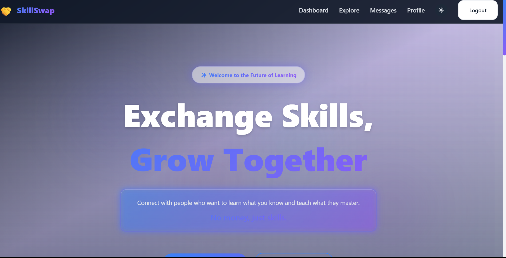
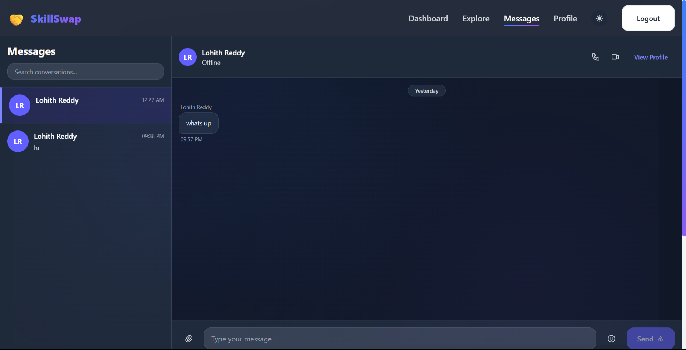
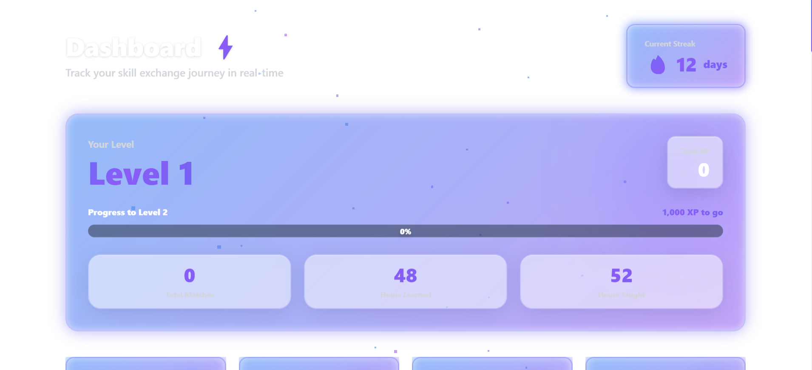

<div align="center">

# 🎓 SkillSwap - Exchange Skills, Learn Together

[](https://reactjs.org/)
[](https://vitejs.dev/)
[](https://firebase.google.com/)
[](https://tailwindcss.com/)
[](./LICENSE)

**🚀 A modern peer-to-peer skill exchange platform connecting learners and teachers worldwide**

[🌐 Live Demo](https://skill-swap-lb5xzdg6z-lohith1234567s-projects.vercel.app/) • [📹 Video Demo](#) • [📖 Documentation](./skill-exchange-platform/docs/) • [🐛 Report Bug](https://github.com/Lohith1234567/skill-exchange-platform/issues) • [✨ Request Feature](https://github.com/Lohith1234567/skill-exchange-platform/issues)

</div>

---

## 📑 Table of Contents

- [🎯 Problem Statement](#-problem-statement)
- [💡 Solution](#-solution)
- [✨ Key Features](#-key-features)
- [🛠️ Tech Stack](#️-tech-stack)
- [🎨 Design System](#-design-system)
- [📸 Screenshots](#-screenshots)
- [🚀 Getting Started](#-getting-started)
  - [Prerequisites](#prerequisites)
  - [Installation](#installation)
  - [Environment Setup](#environment-setup)
  - [Running Locally](#running-locally)
- [📁 Project Structure](#-project-structure)
- [🎮 Usage Guide](#-usage-guide)
- [🔐 Demo Credentials](#-demo-credentials)
- [🏗️ Architecture](#️-architecture)
- [🎯 Hackathon Alignment](#-hackathon-alignment)
- [🗺️ Roadmap](#️-roadmap)
- [👥 Contributors](#-contributors)
- [📄 License](#-license)
- [🤝 Contributing](#-contributing)
- [⭐ Show Your Support](#-show-your-support)

---

## 🎯 Problem Statement

In today's world, people possess diverse skills but lack accessible platforms to:
- **Exchange knowledge** without monetary transactions
- **Connect with peers** who share complementary learning goals
- **Track progress** in a gamified, engaging way
- **Build meaningful relationships** through mutual skill sharing

Traditional learning platforms are:
- 💸 **Expensive** - High subscription fees
- 🎓 **Formal** - Rigid course structures
- 👤 **Impersonal** - No peer-to-peer interaction
- 📈 **Non-gamified** - Lack of motivation systems

---

## 💡 Solution

**SkillSwap** is a revolutionary peer-to-peer platform that enables users to:

🔄 **Exchange skills freely** - Teach what you know, learn what you want  
🤝 **Connect instantly** - Smart matching algorithm finds perfect skill partners  
🎮 **Level up** - XP system, badges, and streaks make learning addictive  
💬 **Real-time chat** - Coordinate sessions seamlessly  
📊 **Track progress** - Comprehensive dashboard with analytics  
🌙 **Beautiful UI** - Modern dark mode, glassmorphism, and smooth animations

---

## ✨ Key Features

### 🔐 Authentication & Profiles
- Firebase Authentication (Email/Google)
- Rich user profiles with avatar upload
- Skills taxonomy (teach/learn categorization)
- Bio, location, and rating system

### 🔍 Smart Matching
- **Mutual match detection** - Find users with complementary skills
- **Match score algorithm** - Ranks compatibility
- **Real-time filtering** - Search by skill, category, or name
- **Skill post creation** - Advertise what you offer/need

### 💬 Real-Time Chat
- Firebase Realtime Database
- Message threads with timestamps
- Unread indicators
- User online status
- Deep-linked conversations from profiles

### 📊 Gamification System
- **XP & Levels** - Earn points for completed exchanges
- **Badges** - Unlock achievements
- **Streaks** - Maintain learning consistency
- **Leaderboards** - Compete with community

### 🎨 Modern UI/UX
- **Glassmorphism effects** - Frosted glass cards
- **3D animations** - GSAP & Framer Motion
- **Smooth transitions** - Page animations and scroll effects
- **Dark mode** - System-aware theme switching
- **Responsive design** - Mobile-first approach
- **Accessibility** - WCAG 2.1 AA compliant

### 📈 Analytics Dashboard
- Exchange statistics
- Skill progress tracking
- Activity timeline
- Streak monitoring
- XP history

---

## 🛠️ Tech Stack

### Frontend
```yaml
Framework:       React 19.1.1
Build Tool:      Vite 7.1.12
Styling:         Tailwind CSS 4.1.16
Routing:         React Router 7.1.3
State:           React Context API
Animations:      Framer Motion, GSAP
Icons:           Heroicons, Custom SVGs
```

### Backend & Services
```yaml
BaaS:            Firebase 12.5.0
  - Authentication (Email/Google)
  - Firestore (User profiles, posts, matches)
  - Realtime Database (Chat messages)
  - Storage (Profile photos)
  - Security Rules
```

### Developer Tools
```yaml
Linting:         ESLint 9.18.0
Formatting:      Prettier (via ESLint)
Package Manager: npm
Version Control: Git & GitHub
```

---

## 🎨 Design System

Our design system ensures consistency across the platform:

- **Color Palette**: Indigo/Purple gradient with dark mode variants
- **Typography**: Inter font family with hierarchical heading system
- **Spacing**: 8px grid system (4, 8, 16, 24, 32, 48, 64px)
- **Components**: Unified button, input, card, badge systems
- **Animations**: 150-300ms transitions, spring physics

See [`docs/DESIGN_SYSTEM.md`](./skill-exchange-platform/docs/DESIGN_SYSTEM.md) for details.

---

## 📸 Screenshots

### 🏠 Landing Page
<div align="center">
  
  <p><em>Beautiful hero section with animated gradient and CTAs</em></p>
</div>

### 🔍 Explore Skills
<div align="center">
  
  <p><em>Smart filtering and mutual match detection</em></p>
</div>

### 💬 Real-Time Chat
<div align="center">
  
  <p><em>Instant messaging with user presence</em></p>
    

### 📊 Dashboard
<div align="center">
  
  <p><em>XP tracking, streaks, and gamification stats</em></p>
</div>

### 👤 Profile Management
<div align="center">
  
  <p><em>Rich profiles with skill tags and bio</em></p>
</div>

---

## 🚀 Getting Started

### Prerequisites

Before you begin, ensure you have:
- **Node.js** >= 18.0.0 ([Download](https://nodejs.org/))
- **npm** >= 9.0.0 (comes with Node)
- **Firebase Account** ([Sign up](https://firebase.google.com/))
- **Git** ([Download](https://git-scm.com/))

### Installation

1️⃣ **Clone the repository**
```bash
git clone https://github.com/Lohith1234567/skill-exchange-platform.git
cd skill-exchange-platform/skill-exchange-platform
```

2️⃣ **Install dependencies**
```bash
npm install
```

3️⃣ **Firebase Setup**

Go to [Firebase Console](https://console.firebase.google.com/):
- Create a new project
- Enable **Authentication** (Email/Password + Google)
- Enable **Firestore Database**
- Enable **Realtime Database**
- Enable **Storage**
- Copy your Firebase config

4️⃣ **Environment Configuration**

Create a `.env` file in the `skill-exchange-platform` directory:

```env
# Firebase Configuration
VITE_FIREBASE_API_KEY=your_api_key_here
VITE_FIREBASE_AUTH_DOMAIN=your-project.firebaseapp.com
VITE_FIREBASE_PROJECT_ID=your-project-id
VITE_FIREBASE_STORAGE_BUCKET=your-project-id.appspot.com
VITE_FIREBASE_MESSAGING_SENDER_ID=your_sender_id
VITE_FIREBASE_APP_ID=your_app_id
VITE_FIREBASE_DATABASE_URL=https://your-project-default-rtdb.firebaseio.com
```

> ⚠️ **Important**: The `STORAGE_BUCKET` must be in format `<project-id>.appspot.com`, not `firebasestorage.app`

5️⃣ **Setup Firebase Security Rules**

See [`FIREBASE_RULES_SETUP.md`](./skill-exchange-platform/FIREBASE_RULES_SETUP.md) for:
- Firestore security rules
- Realtime Database rules
- Storage rules

### Running Locally

**Development Mode**
```bash
npm run dev
```
Opens at `http://localhost:5173` (or next available port)

**Production Build**
```bash
npm run build
npm run preview
```

**Linting**
```bash
npm run lint
```

---

## 📁 Project Structure

```
skill-exchange-platform/
├── 📂 public/               # Static assets
├── 📂 src/
│   ├── 📂 assets/           # Images, icons
│   ├── 📂 components/       # React components
│   │   ├── 📂 animations/   # Framer Motion components
│   │   ├── 📂 common/       # Reusable UI (Button, Card, Input)
│   │   ├── 📂 forms/        # Form components
│   │   ├── 📂 layout/       # Navbar, Footer, MainLayout
│   │   ├── 📂 modals/       # Modal dialogs
│   │   └── 📂 ui/           # Specialized UI (Glass, Neon)
│   ├── 📂 config/           # Firebase config
│   ├── 📂 constants/        # App constants
│   ├── 📂 contexts/         # React Context (Auth, DarkMode)
│   ├── 📂 firebase/         # Firebase initialization
│   ├── 📂 hooks/            # Custom hooks
│   ├── 📂 pages/            # Page components
│   │   ├── Landing/
│   │   ├── Login/
│   │   ├── Profile/
│   │   ├── Explore/
│   │   ├── Chat/
│   │   └── Dashboard/
│   ├── 📂 routes/           # Route definitions
│   ├── 📂 services/         # API & Firebase services
│   ├── 📂 utils/            # Helper functions
│   ├── App.jsx              # Root component
│   ├── main.jsx             # Entry point
│   └── index.css            # Global styles + Design System
├── 📂 docs/                 # Documentation
├── .env.example             # Environment template
├── package.json             # Dependencies
├── vite.config.js           # Vite configuration
├── tailwind.config.js       # Tailwind config
└── README.md                # You are here!
```

---

## 🎮 Usage Guide

### 1️⃣ Sign Up / Login
- Click "Get Started" on landing page
- Sign up with email or Google
- Complete your profile (name, bio, skills)

### 2️⃣ Set Your Skills
- Navigate to **Profile**
- Add skills you can **teach** (e.g., React, Guitar, Spanish)
- Add skills you want to **learn** (e.g., Python, Photography)
- Upload a profile picture

### 3️⃣ Find Matches
- Go to **Explore** page
- Browse skill posts or search by keyword
- Filter by category
- Look for **🔥 Mutual Match** badges (best matches!)
- Click profiles to view details

### 4️⃣ Connect & Chat
- Click **"Chat"** button on any user's profile
- Send a message to introduce yourself
- Coordinate exchange sessions
- Schedule video calls (external)

### 5️⃣ Complete Exchanges
- After a successful skill exchange session
- Mark it as complete in your Dashboard
- Both users earn **50 XP**
- Level up and unlock badges!

### 6️⃣ Track Progress
- Visit **Dashboard** to see:
  - Current level & XP
  - Active exchanges
  - Streak counter
  - Recent activity

---

## 🔐 Demo Credentials

For testing purposes:

```
Email:    demo@skillswap.com
Password: Demo@1234
```

> 🔒 **Note**: Create your own account for full experience. Demo account has limited sample data.

---

## 🏗️ Architecture

### Data Flow
```
User Action → React Component → Context/Service → Firebase → Real-time Update
```

### Key Services

**`authService.js`**
- User registration, login, logout
- Google OAuth integration
- Session persistence

**`firebaseService.js`**
- User profile CRUD
- Skill posts management
- Match creation & retrieval
- XP/gamification logic

**`chatService.js`** (via `firebaseService.js`)
- Real-time message sync
- Chat list subscriptions
- Unread tracking

### State Management

We use **React Context API** for global state:
- `AuthContext` - User authentication state
- `DarkModeContext` - Theme preferences

### Matching Algorithm

```javascript
function computeMatchScore(userA_teaches, userA_wants, userB_teaches, userB_wants) {
  // Count skills userA teaches that userB wants
  const aHelpsB = intersection(userA_teaches, userB_wants).length;
  
  // Count skills userB teaches that userA wants
  const bHelpsA = intersection(userB_teaches, userA_wants).length;
  
  // Mutual match if both can help each other
  const isMutual = aHelpsB > 0 && bHelpsA > 0;
  
  return { score: aHelpsB + bHelpsA, isMutual };
}
```

See [`src/utils/matching.js`](./skill-exchange-platform/src/utils/matching.js)

---

## 🎯 Hackathon Alignment

### Theme: **Community-Driven Learning & Collaboration**

**How SkillSwap Embodies This:**

✅ **Community-First Design**
- Peer-to-peer knowledge sharing
- No gatekeeping or paywalls
- Equal access to skills

✅ **Collaboration Tools**
- Real-time chat
- Match recommendations
- Profile-based networking

✅ **Engagement & Retention**
- Gamification (XP, badges, streaks)
- Progress tracking
- Social proof (ratings, exchanges)

✅ **Accessibility**
- WCAG 2.1 AA compliant
- Keyboard navigation
- Screen reader support
- Reduced motion options

✅ **Scalability**
- Firebase backend handles millions
- Serverless architecture
- Real-time synchronization

### Impact Metrics
- **Knowledge Democratization**: Free skill exchange
- **Community Building**: Connect 1000s of users
- **Learning Efficiency**: Personalized matches
- **Social Good**: Mutual benefit model

---

## 🗺️ Roadmap

### 🚀 Phase 1: MVP (Completed)
- [x] User authentication
- [x] Profile management
- [x] Skill posting
- [x] Basic matching
- [x] Real-time chat
- [x] XP system

### 🎯 Phase 2: Enhancement (In Progress)
- [ ] Video call integration (Agora/Twilio)
- [ ] Advanced search filters
- [ ] User reviews & ratings
- [ ] Notification system (email/push)
- [ ] Mobile app (React Native)

### 🌟 Phase 3: Scale (Future)
- [ ] AI-powered skill recommendations
- [ ] Group learning sessions
- [ ] Scheduled sessions calendar
- [ ] Payment gateway (optional premium)
- [ ] Skill verification system
- [ ] Mentor/Mentee formal programs
- [ ] Community forums
- [ ] Skill challenges/competitions

### 🔮 Long-Term Vision
- [ ] Multi-language support (i18n)
- [ ] Blockchain-based skill certificates
- [ ] Integration with LinkedIn/resume builders
- [ ] Corporate team skill-swap modules
- [ ] Educational institution partnerships

---

## 👥 Contributors

<table>
  <tr>
    <td align="center">
      <a href="https://github.com/Lohith1234567">
        <br />
        <sub><b>Lohith Reddy</b></sub>
      </a><br />
      <sub>Full-Stack Developer</sub>
    </td>
    <td align="center">
      <br />
      <sub><b>Rohith</b></sub><br />
      <sub>Developer</sub>
    </td>
    <td align="center">
      <br />
      <sub><b>Saketh</b></sub><br />
      <sub>Developer</sub>
    </td>
  </tr>
</table>

---

## 📄 License

This project is licensed under the **MIT License** - see the [LICENSE](./LICENSE) file for details.

```
MIT License

Copyright (c) 2025 Lohith Reddy

Permission is hereby granted, free of charge, to any person obtaining a copy
of this software and associated documentation files (the "Software"), to deal
in the Software without restriction...
```

---

## 🤝 Contributing

Contributions, issues, and feature requests are welcome! 🎉

1. Fork the project
2. Create your feature branch (`git checkout -b feature/AmazingFeature`)
3. Commit your changes (`git commit -m 'Add some AmazingFeature'`)
4. Push to the branch (`git push origin feature/AmazingFeature`)
5. Open a Pull Request

See [`CONTRIBUTING.md`](./CONTRIBUTING.md) for detailed guidelines.

---

## 📞 Contact & Support

- 📧 Email: lohithreddyummadi12@gmail.com


**Found a bug?** [Report it here](https://github.com/Lohith1234567/skill-exchange-platform/issues)

**Have a question?** [Start a discussion](https://github.com/Lohith1234567/skill-exchange-platform/discussions)

---

## ⭐ Show Your Support

If you found this project helpful or inspiring, please give it a ⭐!

<div align="center">

### 🌟 Star this repository to support the project! 🌟

[](https://github.com/Lohith1234567/skill-exchange-platform/stargazers)
[](https://github.com/Lohith1234567/skill-exchange-platform/network/members)

---

**Made with ❤️ by [Lohith Reddy](https://github.com/Lohith1234567)**
                **[Rohith](https://github.com/rohithk2626)**
*Empowering communities through skill exchange*

</div>

